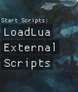
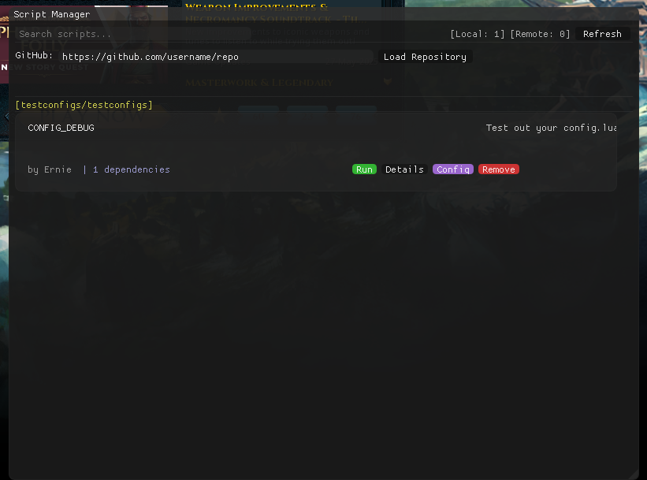
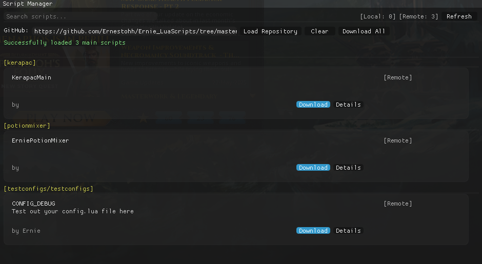
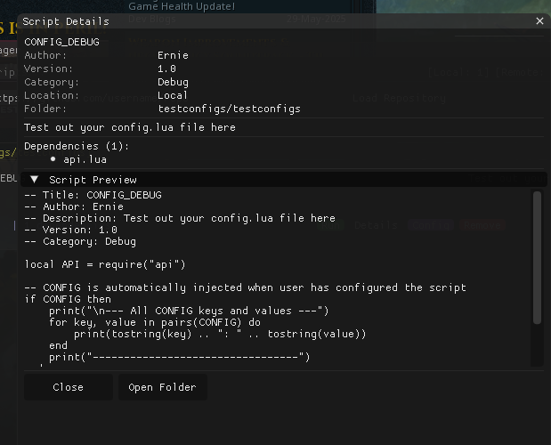
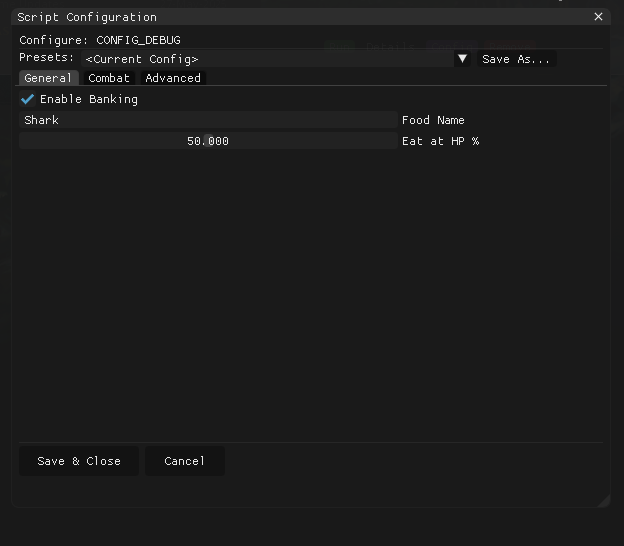
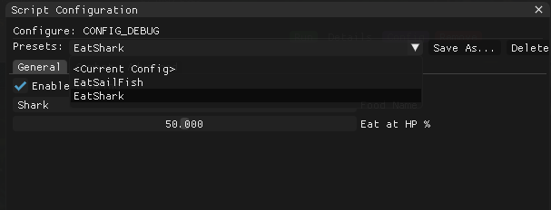

# Script Manager - How to use

## Table of Contents
1. [Getting Started](#getting-started)
2. [Script Structure](#script-structure)
3. [Configuration System](#configuration-system)
4. [Script Organization](#script-organization)
5. [Your Github Repository](#your-github-repository)

## Getting Started

**You can try it out using the test.lua CONFIG_DEBUG in Script Manager)

The Script Manager can be used to create more complex scripts that require more user info. It can also be used to download from github without having to setup move around files.




### Where to Place Your Scripts

Scripts go in the `Lua_Scripts/` directory:
```
MemoryError/
└── Lua_Scripts/
    ├── api.lua                     # Core API (don't modify)
    ├── usertypes.lua               # Type definitions (don't modify)
    ├── simple_script/              # Single script in folder
        └── my_simple_script2.lua
    └── my_complex_bot/             # multiple script in folder
        ├── main.lua
        ├── config.lua
        └── helpers.lua
```

### What Makes a Script Visible

**Only scripts containing the main game loop are shown in Script Manager:**

```lua
-- This makes your script appear in Script Manager
while (API.Read_LoopyLoop()) do
    -- Your automation logic here
end
```

Scripts without this loop pattern are considered helper modules and won't appear in the Script Manager.

### Script with Metadata

```lua
-- Title: Advanced Miner
-- Author: YourName
-- Description: Mines ore with banking support
-- Version: 1.0
-- Category: mining

local API = require("api")

while (API.Read_LoopyLoop()) do
    -- Your mining logic here
end
```

## Script Structure

### Single File Scripts

For simple scripts, use a single `.lua` file:

### Multi-File Scripts

For complex scripts, organize in folders:

```
└── Lua_Scripts
    └── my_boss_killer/
        ├── main.lua         # Entry point with game loop
        ├── config.lua       # User configuration
        ├── combat.lua       # Combat logic
        ├── banking.lua      # Banking functions
        └── data/
            └── items.lua    # Item IDs and data
```

**main.lua:**
```lua
-- Title: Advanced Miner
-- Author: YourName
-- Description: Mines ore with banking support
-- Version: 1.0
-- Category: mining

local API = require("api")
local Combat = require("my_boss_killer.combat")
local Banking = require("my_boss_killer.banking")
local Config = require("my_boss_killer.config")

while (API.Read_LoopyLoop()) do
    if API.InvFull_() then
        Banking.doBanking()
    else
        Combat.fightBoss(Config.BOSS_NAME)
    end
    API.RandomSleep2(100, 200, 300)
end
```


## Configuration System

### Creating User-Configurable Scripts

The Script Manager provides a configuration UI system. Create a `config.lua` file in your script's folder:

```lua
-- config.lua
SM:AddTab("General")                                                                -- Create a tab named General, populated by the elements below
SM:Checkbox("Enable Banking", "enableBanking", true)                                -- Will create a checkbox named Enable Banking, is referenced by CONFIG by enableBanking, is default true
SM:TextInput("Food Name", "foodName", "Shark")                                      -- Will create an input box named Food Name, is referenced by CONFIG by foodName, is default Shark
SM:Slider("Eat at HP %", "eatPercent", 0, 100, 50)                                  -- Will create a slider named Eat at HP %, is referenced by CONFIG by eatPercent, min value = 0, max value = 100, is default 50

SM:AddTab("Combat")                                                                 -- Create a tab named Combat, populated by the elements below
SM:Dropdown("Attack Style", "attackStyle", {"Melee", "Range", "Magic"}, "Melee")    -- Will create a dropdown named Attack Style, is referenced by CONFIG by attackStyle, dropdown info, is default Melee
SM:Checkbox("Use Prayers", "usePrayers", false)
SM:PasswordInput("Bank PIN", "bankPin", "")                                         -- Will create a password input named Bank PIN, is referenced by CONFIG by bankPin, is default empty (input is converted to ***)    

SM:AddTab("Advanced")                                                               -- Create a tab named Advanced, populated by the elements below
SM:NumberInput("Max Runtime (minutes)", "maxRuntime", 180, 1, 999)                  -- Will create a number input named Max Runtime (minutes), is referenced by CONFIG by maxRuntime, is default 180, 
                                                                                    -- min value = 1, max value = 999
```


### Accessing Configuration in Your Script

```lua
-- main.lua
local API = require("api")

-- CONFIG is automatically injected when user has configured the script
if CONFIG then
    print("Banking enabled:", CONFIG.enableBanking)  -- Uses the reference key setup in config.lua
    print("Food to use:", CONFIG.foodName)
    print("Attack style index:", CONFIG.attackStyle) -- 0=Melee, 1=Range, 2=Magic, array will start at 0
    
    -- Convert dropdown index to string
    local styles = {"Melee", "Range", "Magic"}
    local selectedStyle = styles[CONFIG.attackStyle + 1] -- Lua arrays start at 1
end

while (API.Read_LoopyLoop()) do
    -- Use configuration values
    if CONFIG and CONFIG.enableBanking and API.InvFull_() then
        -- Bank inventory
    end
    
    local hpPercent = API.GetHPrecent()
    if CONFIG and hpPercent < CONFIG.eatPercent then
        -- Eat food
    end
end
```

### Configuration Elements Reference

```lua
-- Text input
SM:TextInput("Label", "key", "default value")

-- Password input (masked)
SM:PasswordInput("Label", "key", "default")

-- Number input
SM:NumberInput("Label", "key", defaultNumber, minValue, maxValue)

-- Checkbox
SM:Checkbox("Label", "key", defaultBoolean)

-- Dropdown (returns 0-based index)
SM:Dropdown("Label", "key", {"Option1", "Option2"}, "DefaultOption")

-- Slider
SM:Slider("Label", "key", minValue, maxValue, defaultValue)

-- Create tabs to organize options
SM:AddTab("Tab Name")
```

### Saving Presets of different Configurations




## Script Organization

### Project Structure Best Practices

```
└── Lua_Scripts/                  # Base folder
    └── my_script_package/
        ├── main.lua              # Entry point (contains game loop)
        ├── config.lua            # User configuration UI
        ├── modules/              # Reusable modules
        │   ├── combat.lua
        │   ├── banking.lua
        │   └── utils.lua
        └── data/                 # Data files
            ├── items.lua
            └── locations.lua
```

## Your Github Repository

Structure your repository for easy discovery:

```
your-repo/
├── README.md            # Describe your scripts
├── woodcutter/          # Each script in its own folder
│   ├── main.lua         # Must contain game loop
│   ├── config.lua       # Optional configuration
└── miner/
    ├── main.lua
    └── config.lua
```

### Repository Best Practices

1. **One main.lua per folder** - Script Manager detects folders as script packages
2. **Include config.lua** - For user-configurable options
3. **Use clear folder names** - Users see the folder structure

## Troubleshooting

### Script Not Appearing in Script Manager

1. **Check for game loop:**
```lua
-- Must have this exact pattern
while (API.Read_LoopyLoop()) do
    -- code
end
```

2. **Check file location:** Must be in `Lua_Scripts/` or subdirectory

3. **Check file extension:** Must be `.lua`

### Configuration Not Working

1. **Check config.lua location:** Must be in same folder as main script

2. **Check CONFIG availability:**
```lua
if CONFIG then
    print("Config loaded!")
else
    print("No config - using defaults")
end
```
